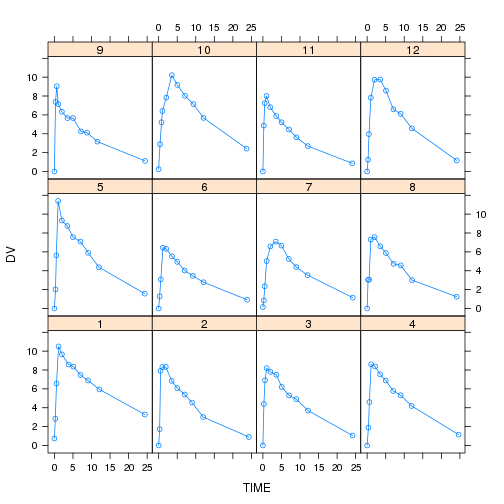

<https://github.com/asancpt/edison-nmw>  
license: GPL-3

## Introduction

NONMEM Workshop 2017, 2018에서 사용된 nmw 패키지를 사용한 Edison 사이언스 앱입니다.

## Result

A table (head) and a figure of input dataset is shown below.

### Initial values


```r
kable(inputFirst, format = "markdown")
```


|name      |value                                       |
|:---------|:-------------------------------------------|
|Dataset   |Theoph                                      |
|Method    |COND                                        |
|nTheta    |3                                           |
|nEta      |3                                           |
|nEps      |2                                           |
|THETAinit |2, 50, 0.1                                  |
|OMinit    |0.2, 0.1, 0.1, 0.1, 0.2, 0.1, 0.1, 0.1, 0.2 |
|SGinit    |0.1, 0, 0, 0.1                              |

### Input Table


```r
kable(head(DataAll, n = 20), caption = "input data", format = "markdown")
```


|ID |  TIME|    DV|
|:--|-----:|-----:|
|1  |  0.00|  0.74|
|1  |  0.25|  2.84|
|1  |  0.57|  6.57|
|1  |  1.12| 10.50|
|1  |  2.02|  9.66|
|1  |  3.82|  8.58|
|1  |  5.10|  8.36|
|1  |  7.03|  7.47|
|1  |  9.05|  6.89|
|1  | 12.12|  5.94|
|1  | 24.37|  3.28|
|2  |  0.00|  0.00|
|2  |  0.27|  1.72|
|2  |  0.52|  7.91|
|2  |  1.00|  8.31|
|2  |  1.92|  8.33|
|2  |  3.50|  6.85|
|2  |  5.02|  6.08|
|2  |  7.03|  5.40|
|2  |  9.00|  4.55|

### Figure


```r
if (NMDataset == "Emax") xyplot(DV ~ log(CE) | ID, data=DataAll, type="b")
if (NMDataset == "Theoph") {
  xyplot(DV~TIME|ID, 
         data=DataAll, 
         type="b",
         index.cond=list(order(as.numeric(levels(unique(DataAll$ID))))))
}
```



### Method Calculation

- Dataset: Theoph
- Method: COND


```r
PREDFILE <- ifelse(NMDataset == "Emax", "03-Emax/PRED.R", "04-THEO/PRED.R")
source(PREDFILE)

FGD <- deriv(expr = ~ DOSE/
               (TH2*exp(ETA2)) * 
               TH1*exp(ETA1)/
               (TH1*exp(ETA1) - TH3*exp(ETA3)) *
               (exp(-TH3*exp(ETA3)*TIME)-exp(-TH1*exp(ETA1)*TIME)),
             namevec = c("ETA1","ETA2","ETA3"),
             function.arg = c("TH1", "TH2", "TH3", 
                              "ETA1", "ETA2", "ETA3", 
                              "DOSE", "TIME"),
             func=TRUE, 
             hessian=TRUE)

H <- deriv(~F + F*EPS1 + EPS2, c("EPS1", "EPS2"), 
           function.arg=c("F", "EPS1", "EPS2"), 
           func=TRUE)

InitPara <- nmw::InitStep(DataAll, 
                          THETAinit=THETAinit, 
                          OMinit=OMinit, 
                          SGinit=SGinit, 
                          LB=LB, 
                          UB=UB, 
                          Pred=PRED,
                          METHOD=METHOD)
(EstRes = EstStep()) # 0.6200359 secs, 0.4930282 secs
```

```
## $`Initial OFV`
## [1] 188.7005
## 
## $Time
## Time difference of 2.053784 mins
## 
## $Optim
## $Optim$par
##  [1] -0.191038342 -0.331507105 -0.036604792  0.490015633  0.038777478
##  [6] -0.004544747 -1.148169722  0.087407760 -1.321560134 -0.772014649
## [11] -0.019855262
## 
## $Optim$value
## [1] 92.2179
## 
## $Optim$counts
## function gradient 
##       64       64 
## 
## $Optim$convergence
## [1] 0
## 
## $Optim$message
## [1] "CONVERGENCE: REL_REDUCTION_OF_F <= FACTR*EPSMCH"
## 
## 
## $`Final Estimates`
##  [1]  1.494974789 32.477041485  0.087231491  0.436308094  0.057274486
##  [6]  0.019876368 -0.006712609  0.011663141  0.020602621  0.017481460
## [11]  0.078685560
```

```r
(CovRes = CovStep())
```

```
## $Time
## Time difference of 54.10309 secs
## 
## $`Standard Error`
##  [1] 0.343329779 1.707724512 0.003845457 0.240759851 0.048796392
##  [6] 0.023296233 0.042579379 0.018214087 0.034838779 0.009644326
## [11] 0.062764272
## 
## $`Covariance Matrix of Estimates`
##                [,1]          [,2]          [,3]          [,4]
##  [1,]  0.1178753370  0.3257709609 -3.138296e-04  0.0449271375
##  [2,]  0.3257709609  2.9163230078  9.528463e-04  0.0117646115
##  [3,] -0.0003138296  0.0009528463  1.478754e-05 -0.0003818976
##  [4,]  0.0449271375  0.0117646115 -3.818976e-04  0.0579653056
##  [5,]  0.0046498909 -0.0289574329 -6.588987e-05  0.0085920048
##  [6,] -0.0015850872 -0.0082040885 -8.255648e-06  0.0001760737
##  [7,] -0.0013216131  0.0219967109  9.812688e-05 -0.0050430722
##  [8,]  0.0009423561  0.0047046258 -3.935965e-06  0.0008179267
##  [9,] -0.0004880641 -0.0190762111 -8.911725e-05  0.0025871642
## [10,] -0.0003309453  0.0024072682  1.802441e-05 -0.0014994314
## [11,]  0.0005763975 -0.0403410196 -1.528631e-04  0.0089227863
##                [,5]          [,6]          [,7]          [,8]
##  [1,]  4.649891e-03 -1.585087e-03 -1.321613e-03  9.423561e-04
##  [2,] -2.895743e-02 -8.204088e-03  2.199671e-02  4.704626e-03
##  [3,] -6.588987e-05 -8.255648e-06  9.812688e-05 -3.935965e-06
##  [4,]  8.592005e-03  1.760737e-04 -5.043072e-03  8.179267e-04
##  [5,]  2.381088e-03  6.754867e-04 -4.131683e-04 -3.910530e-04
##  [6,]  6.754867e-04  5.427145e-04  3.708019e-04 -3.819689e-04
##  [7,] -4.131683e-04  3.708019e-04  1.813004e-03 -4.546660e-04
##  [8,] -3.910530e-04 -3.819689e-04 -4.546660e-04  3.317530e-04
##  [9,]  9.992286e-04  4.790779e-04 -6.173928e-04 -2.762646e-04
## [10,] -3.528927e-04 -1.223755e-04  1.614071e-04  5.439237e-05
## [11,]  1.934613e-03  4.362098e-04 -1.919342e-03 -3.893778e-05
##                [,9]         [,10]         [,11]
##  [1,] -4.880641e-04 -3.309453e-04  5.763975e-04
##  [2,] -1.907621e-02  2.407268e-03 -4.034102e-02
##  [3,] -8.911725e-05  1.802441e-05 -1.528631e-04
##  [4,]  2.587164e-03 -1.499431e-03  8.922786e-03
##  [5,]  9.992286e-04 -3.528927e-04  1.934613e-03
##  [6,]  4.790779e-04 -1.223755e-04  4.362098e-04
##  [7,] -6.173928e-04  1.614071e-04 -1.919342e-03
##  [8,] -2.762646e-04  5.439237e-05 -3.893778e-05
##  [9,]  1.213741e-03 -2.468340e-04  1.842491e-03
## [10,] -2.468340e-04  9.301303e-05 -4.670010e-04
## [11,]  1.842491e-03 -4.670010e-04  3.939354e-03
## 
## $`Correlation Matrix of Estimates`
##              [,1]        [,2]        [,3]        [,4]       [,5]
##  [1,]  1.00000000  0.55562667 -0.23770290  0.54351710  0.2775515
##  [2,]  0.55562667  1.00000000  0.14509654  0.02861381 -0.3474998
##  [3,] -0.23770290  0.14509654  1.00000000 -0.41249143 -0.3511422
##  [4,]  0.54351710  0.02861381 -0.41249143  1.00000000  0.7313457
##  [5,]  0.27755150 -0.34749978 -0.35114216  0.73134574  1.0000000
##  [6,] -0.19817825 -0.20621812 -0.09215470  0.03139242  0.5942147
##  [7,] -0.09040523  0.30251061  0.59929505 -0.49193962 -0.1988566
##  [8,]  0.15069408  0.15125156 -0.05619476  0.18651893 -0.4399876
##  [9,] -0.04080397 -0.32063534 -0.66519790  0.30844448  0.5877792
## [10,] -0.09994770  0.14616210  0.48600557 -0.64575926 -0.7498650
## [11,]  0.02674842 -0.37637135 -0.63334764  0.59047828  0.6316753
##              [,6]        [,7]        [,8]        [,9]      [,10]
##  [1,] -0.19817825 -0.09040523  0.15069408 -0.04080397 -0.0999477
##  [2,] -0.20621812  0.30251061  0.15125156 -0.32063534  0.1461621
##  [3,] -0.09215470  0.59929505 -0.05619476 -0.66519790  0.4860056
##  [4,]  0.03139242 -0.49193962  0.18651893  0.30844448 -0.6457593
##  [5,]  0.59421474 -0.19885656 -0.43998764  0.58777920 -0.7498650
##  [6,]  1.00000000  0.37381514 -0.90019155  0.59027930 -0.5446745
##  [7,]  0.37381514  1.00000000 -0.58625389 -0.41619732  0.3930534
##  [8,] -0.90019155 -0.58625389  1.00000000 -0.43536634  0.3096412
##  [9,]  0.59027930 -0.41619732 -0.43536634  1.00000000 -0.7346325
## [10,] -0.54467452  0.39305337  0.30964117 -0.73463251  1.0000000
## [11,]  0.29833020 -0.71819203 -0.03406052  0.84261639 -0.7714956
##             [,11]
##  [1,]  0.02674842
##  [2,] -0.37637135
##  [3,] -0.63334764
##  [4,]  0.59047828
##  [5,]  0.63167529
##  [6,]  0.29833020
##  [7,] -0.71819203
##  [8,] -0.03406052
##  [9,]  0.84261639
## [10,] -0.77149557
## [11,]  1.00000000
## 
## $`Inverse Covariance Matrix of Estimates`
##              [,1]        [,2]        [,3]         [,4]         [,5]
##  [1,]    94.14289  -18.830548   1899.3717    245.13146   -2089.2012
##  [2,]   -18.83055    4.938307   -398.6819    -62.25571     487.9919
##  [3,]  1899.37167 -398.681855 249350.3935   5572.98931  -38648.4406
##  [4,]   245.13146  -62.255707   5572.9893   2508.34554  -16016.3036
##  [5,] -2089.20123  487.991905 -38648.4406 -16016.30362  108118.3489
##  [6,]  2205.58120 -444.438161  44370.0303  15507.64141 -105052.6212
##  [7,] -1246.19795  228.835611 -25711.0044 -15322.08095   97740.3736
##  [8,] -3282.99320  696.022606 -31002.1363 -42102.30301  269766.8179
##  [9,] -1110.12057  193.788688  16402.0735 -12555.03598   83750.8997
## [10,]   946.94833 -155.992459  18774.0536  23046.33017 -135931.4313
## [11,]    85.49135   -2.328671 -11520.0492    732.60656   -6381.4473
##               [,6]         [,7]         [,8]         [,9]        [,10]
##  [1,]    2205.5812   -1246.1980   -3282.9932   -1110.1206     946.9483
##  [2,]    -444.4382     228.8356     696.0226     193.7887    -155.9925
##  [3,]   44370.0303  -25711.0044  -31002.1363   16402.0735   18774.0536
##  [4,]   15507.6414  -15322.0809  -42102.3030  -12555.0360   23046.3302
##  [5,] -105052.6212   97740.3736  269766.8179   83750.8997 -135931.4313
##  [6,]  128285.3786 -104612.4173 -252309.1008  -84958.2522  151141.7351
##  [7,] -104612.4173  114145.6487  293594.5831   93543.9045 -166749.9752
##  [8,] -252309.1008  293594.5831  819835.8823  259111.9627 -433959.0439
##  [9,]  -84958.2522   93543.9045  259111.9627   93296.2109 -135245.1663
## [10,]  151141.7351 -166749.9752 -433959.0439 -135245.1663  310124.4660
## [11,]    3298.6060   -5186.4822  -24261.0881  -12032.5091   11298.2048
##               [,11]
##  [1,]     85.491350
##  [2,]     -2.328671
##  [3,] -11520.049158
##  [4,]    732.606563
##  [5,]  -6381.447289
##  [6,]   3298.606010
##  [7,]  -5186.482194
##  [8,] -24261.088086
##  [9,] -12032.509110
## [10,]  11298.204758
## [11,]   5080.122399
## 
## $`Eigen Values`
##  [1] 0.0009904174 0.0157407843 0.0315747784 0.0500147198 0.1104912531
##  [6] 0.2311610462 0.4827072872 0.8339135712 1.7444213270 2.6912515128
## [11] 4.8077333025
## 
## $`R Matrix`
##              [,1]        [,2]        [,3]         [,4]         [,5]
##  [1,]  18.8012513  -2.2046769   225.77985   -0.1465552   -12.697216
##  [2,]  -2.2046769   0.6645096   -33.05175   -0.4589011     5.717464
##  [3,] 225.7798537 -33.0517452 43162.57613  149.0174270 -1420.263179
##  [4,]  -0.1465552  -0.4589011   149.01743   66.8376280  -341.808878
##  [5,] -12.6972163   5.7174640 -1420.26318 -341.8088779  3033.820347
##  [6,]  30.0931922 -10.4281894  2285.54968  370.5125005 -4764.965849
##  [7,]  10.1636059  -2.6040938   655.35407  107.5304852  -400.048865
##  [8,] -10.5377078   4.7219807  -552.46780 -201.8886249  1799.598586
##  [9,]  -4.0262676   1.9650324  -842.54472   59.9517718  -358.198859
## [10,] 110.6979157 -27.4491261  3028.27516  173.2219875 -1606.444117
## [11,]  -4.0238297  -0.6323363    26.22163   13.9710247  -339.905473
##              [,6]         [,7]         [,8]         [,9]       [,10]
##  [1,]    30.09319    10.163606   -10.537708    -4.026268   110.69792
##  [2,]   -10.42819    -2.604094     4.721981     1.965032   -27.44913
##  [3,]  2285.54968   655.354071  -552.467797  -842.544724  3028.27516
##  [4,]   370.51250   107.530485  -201.888625    59.951772   173.22199
##  [5,] -4764.96585  -400.048865  1799.598586  -358.198859 -1606.44412
##  [6,] 15847.46070   541.777435 -2001.858260   625.019739  5561.25552
##  [7,]   541.77743  -183.299877 -2671.889440  1301.517689  1290.60030
##  [8,] -2001.85826 -2671.889440 18626.548357 -3025.249423 -6379.98554
##  [9,]   625.01974  1301.517689 -3025.249423  5320.516803  2955.83753
## [10,]  5561.25552  1290.600300 -6379.985542  2955.837533 87787.85042
## [11,]   423.54214  -539.434745 -1379.136159    32.944973  6295.20060
##               [,11]
##  [1,]    -4.0238297
##  [2,]    -0.6323363
##  [3,]    26.2216279
##  [4,]    13.9710247
##  [5,]  -339.9054732
##  [6,]   423.5421370
##  [7,]  -539.4347448
##  [8,] -1379.1361586
##  [9,]    32.9449730
## [10,]  6295.2005997
## [11,]  1141.7530516
## 
## $`S Matrix`
##              [,1]         [,2]         [,3]         [,4]         [,5]
##  [1,]   21.878934   -2.1617003    229.27742    -7.199371    170.56370
##  [2,]   -2.161700    0.6399393    -26.46949     2.736611    -19.54625
##  [3,]  229.277419  -26.4694915  41684.25900   207.472758  -1573.06979
##  [4,]   -7.199371    2.7366114    207.47276    67.475499   -576.10963
##  [5,]  170.563699  -19.5462485  -1573.06979  -576.109625   7666.82628
##  [6,] -417.804918    9.2903759   5438.49660  1676.692630 -24743.03593
##  [7,]    4.765143   -8.1628323  -1021.42781   270.481581  -3868.83377
##  [8,]  113.994065   58.9434284  -3479.73701 -2109.525185  31171.16279
##  [9,] -125.378884  -13.2858239 -16105.78614   765.131964 -12057.77607
## [10,]  341.361817 -159.6079690  36661.48584  -753.609076  -5019.10613
## [11,]  -39.566288  -10.4130449  -6012.33259  -136.550596     97.67359
##                [,6]          [,7]          [,8]         [,9]       [,10]
##  [1,] -4.178049e+02      4.765143     113.99406   -125.37888    341.3618
##  [2,]  9.290376e+00     -8.162832      58.94343    -13.28582   -159.6080
##  [3,]  5.438497e+03  -1021.427808   -3479.73701 -16105.78614  36661.4858
##  [4,]  1.676693e+03    270.481581   -2109.52518    765.13196   -753.6091
##  [5,] -2.474304e+04  -3868.833771   31171.16279 -12057.77607  -5019.1061
##  [6,]  8.827955e+04  15016.112562 -119026.38370  45682.84796  18856.8584
##  [7,]  1.501611e+04   3568.984452  -25353.27346  10845.00780   1460.2168
##  [8,] -1.190264e+05 -25353.273459  192088.63498 -76483.63877 -25058.1180
##  [9,]  4.568285e+04  10845.007796  -76483.63877  39750.38548  -1104.7602
## [10,]  1.885686e+04   1460.216760  -25058.11800  -1104.76021 269888.0254
## [11,]  2.948473e+02    239.380485   -1640.05163   4387.70032  10736.5982
##             [,11]
##  [1,]   -39.56629
##  [2,]   -10.41304
##  [3,] -6012.33259
##  [4,]  -136.55060
##  [5,]    97.67359
##  [6,]   294.84733
##  [7,]   239.38049
##  [8,] -1640.05163
##  [9,]  4387.70032
## [10,] 10736.59821
## [11,]  2910.02752
```

```r
#PostHocEta() # FinalPara from EstStep()
#get("EBE", envir=e)
```

## Appendix

### Examples for Initial Values

#### Emax

```
PRED = function(THETA, ETAi, DATAi)
{
CE   = DATAi[,"CE"]
CE50 = as.numeric(THETA[1] * exp(ETAi[1]))
BASE = as.numeric(THETA[2])
F    = BASE * (1 - CE/(CE50 + CE))
G1   = BASE * CE * CE50 / (CE50 + CE)^2
H1   = rep(1, nrow(DATAi))
D11  = (-2*CE50/(CE + CE50) + 1) * G1

return(cbind(F, G1, H1, D11))
}

nTheta = 2
nEta = 1
nEps = 1

THETAinit = 10, 100
OMinit = 0.2
SGinit = 1
```

#### Theoph (ZERO, CONC)
```
nTheta = 3
nEta = 3
nEps = 2

THETAinit = 2, 50, 0.1
OMinit = 0.2, 0.1, 0.1, 0.1, 0.2, 0.1, 0.1, 0.1, 0.2
SGinit = 0.1, 0, 0, 0.1
```

#### Theoph (LAPL)

```
THETAinit = 4, 50, 0.2
```

The other values are the same with those of `Theoph (ZERO, CONC)`.

## References

[1] K. Bae. _nmw: Understanding Nonlinear Mixed Effects Modeling
for Population Pharmacokinetics_. R package version 0.1.4. 2018.
<URL: https://CRAN.R-project.org/package=nmw>.

[2] K. Bae and D. Yim. "R-based reproduction of the estimation
process hidden behind NONMEM® Part 2: First-order conditional
estimation". In: _Translational and Clinical Pharmacology_ 24.4
(2016), p. 161. DOI: 10.12793/tcp.2016.24.4.161. <URL:
https://doi.org/10.12793/tcp.2016.24.4.161>.

[3] M. Kim, D. Yim and K. Bae. "R-based reproduction of the
estimation process hidden behind NONMEM® Part 1: first-order
approximation method". In: _Translational and Clinical
Pharmacology_ 23.1 (2015), p. 1. DOI: 10.12793/tcp.2015.23.1.1.
<URL: https://doi.org/10.12793/tcp.2015.23.1.1>.

