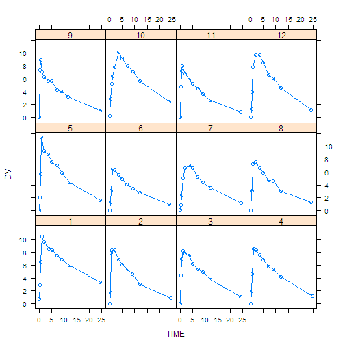

<https://github.com/asancpt/edison-nmw>  
license: GPL-3

## Introduction

NONMEM Workshop 2017, 2018<ec>óê<ec>Ñú <ec>Ǩ<ec>ö©<eb>êú nmw <ed>å®<ed>ǧÏßÄΕ<bc> <ec>Ǩ<ec>ö©<ed>ïú Edison <ec>Ǩ<ec>ù¥<ec>ñ∏<ec>ä§ <ec>ï±<ec>ûÖ<eb>ãà<eb>ã§.

## Result

A table (head) and a figure of input dataset is shown below.

### Initial values


```r
kable(inputFirst, format = "markdown")
```


|name      |value                                       |
|:---------|:-------------------------------------------|
|Dataset   |Theoph                                      |
|Method    |ZERO                                        |
|nTheta    |3                                           |
|nEta      |3                                           |
|nEps      |2                                           |
|THETAinit |2, 50, 0.1                                  |
|OMinit    |0.2, 0.1, 0.1, 0.1, 0.2, 0.1, 0.1, 0.1, 0.2 |
|SGinit    |0.1, 0, 0, 0.1                              |

### Input Table


```r
kable(head(DataAll, n = 20), caption = "input data", format = "markdown")
```


|ID |  TIME|    DV|
|:--|-----:|-----:|
|1  |  0.00|  0.74|
|1  |  0.25|  2.84|
|1  |  0.57|  6.57|
|1  |  1.12| 10.50|
|1  |  2.02|  9.66|
|1  |  3.82|  8.58|
|1  |  5.10|  8.36|
|1  |  7.03|  7.47|
|1  |  9.05|  6.89|
|1  | 12.12|  5.94|
|1  | 24.37|  3.28|
|2  |  0.00|  0.00|
|2  |  0.27|  1.72|
|2  |  0.52|  7.91|
|2  |  1.00|  8.31|
|2  |  1.92|  8.33|
|2  |  3.50|  6.85|
|2  |  5.02|  6.08|
|2  |  7.03|  5.40|
|2  |  9.00|  4.55|

### Figure


```r
#jpeg("xyplot.jpg", type = 'cairo')
if (NMDataset == "Emax") xyplot(DV ~ log(CE) | ID, data=DataAll, type="b")
if (NMDataset == "Theoph") {
  xyplot(DV~TIME|ID, 
         data=DataAll, 
         type="b",
         index.cond=list(order(as.numeric(levels(unique(DataAll$ID))))))
}
```



```r
#dev.off()
```


### Method Calculation

- Dataset: Theoph
- Method: ZERO


```r
PREDFILE <- ifelse(NMDataset == "Emax", "03-Emax/PRED.R", "04-THEO/PRED.R")
source(PREDFILE)

FGD <- deriv(expr = ~ DOSE/
               (TH2*exp(ETA2)) * 
               TH1*exp(ETA1)/
               (TH1*exp(ETA1) - TH3*exp(ETA3)) *
               (exp(-TH3*exp(ETA3)*TIME)-exp(-TH1*exp(ETA1)*TIME)),
             namevec = c("ETA1","ETA2","ETA3"),
             function.arg = c("TH1", "TH2", "TH3", 
                              "ETA1", "ETA2", "ETA3", 
                              "DOSE", "TIME"),
             func=TRUE, 
             hessian=TRUE)

H <- deriv(~F + F*EPS1 + EPS2, c("EPS1", "EPS2"), 
           function.arg=c("F", "EPS1", "EPS2"), 
           func=TRUE)

InitPara <- nmw::InitStep(DataAll, 
                          THETAinit=THETAinit, 
                          OMinit=OMinit, 
                          SGinit=SGinit, 
                          LB=LB, 
                          UB=UB, 
                          Pred=PRED,
                          METHOD=METHOD)
(EstRes = EstStep()) # 0.6200359 secs, 0.4930282 secs
```

```
## $`Initial OFV`
## [1] 141.3076
## 
## $Time
## Time difference of 4.427253 secs
## 
## $Optim
## $Optim$par
##  [1]  0.560417594 -0.167835388  0.148962362  0.995143048  0.056166719
##  [6]  0.151227211 -1.032468525  0.005776729  0.110936464 -0.956899772
## [11] -0.205559310
## 
## $Optim$value
## [1] 57.32106
## 
## $Optim$counts
## function gradient 
##       74       74 
## 
## $Optim$convergence
## [1] 0
## 
## $Optim$message
## [1] "CONVERGENCE: REL_REDUCTION_OF_F <= FACTR*EPSMCH"
## 
## 
## $`Final Estimates`
##  [1]  3.16946754 38.25213460  0.10501808  1.19823325  0.13747849
##  [6]  0.03134899  0.37015671  0.04340042  0.25068582  0.01207782
## [11]  0.05427434
```

```r
(CovRes = CovStep())
```

```
## $Time
## Time difference of 1.372079 secs
## 
## $`Standard Error`
##  [1] 0.641076544 1.685217844 0.023072024 0.420617306 0.082197497
##  [6] 0.019812976 0.340273208 0.023052142 0.289524327 0.003576926
## [11] 0.032078283
## 
## $`Covariance Matrix of Estimates`
##                [,1]         [,2]          [,3]          [,4]          [,5]
##  [1,]  0.4109791347  0.339158144  5.746694e-03  0.2058089645  2.003772e-03
##  [2,]  0.3391581437  2.839959182  5.032613e-03  0.3376028346  3.490465e-02
##  [3,]  0.0057466939  0.005032613  5.323183e-04  0.0016294512 -1.041991e-03
##  [4,]  0.2058089645  0.337602835  1.629451e-03  0.1769189182  1.951490e-02
##  [5,]  0.0020037724  0.034904655 -1.041991e-03  0.0195149026  6.756428e-03
##  [6,] -0.0021925236  0.012804811 -2.503963e-04  0.0032072246  1.504690e-03
##  [7,]  0.1215890847  0.149089319  7.111900e-03  0.0575731487 -1.010198e-02
##  [8,]  0.0009971098  0.023865634  6.271266e-05  0.0042158445  8.584714e-04
##  [9,]  0.0669924083  0.057326151  6.226096e-03  0.0179862543 -1.309239e-02
## [10,]  0.0010500117  0.001807746  5.805488e-05  0.0005143569 -7.516774e-05
## [11,] -0.0049728997 -0.009950377 -4.790610e-04 -0.0010145003  9.532948e-04
##                [,6]          [,7]         [,8]          [,9]         [,10]
##  [1,] -2.192524e-03  0.1215890847 9.971098e-04  0.0669924083  1.050012e-03
##  [2,]  1.280481e-02  0.1490893190 2.386563e-02  0.0573261514  1.807746e-03
##  [3,] -2.503963e-04  0.0071119003 6.271266e-05  0.0062260963  5.805488e-05
##  [4,]  3.207225e-03  0.0575731487 4.215844e-03  0.0179862543  5.143569e-04
##  [5,]  1.504690e-03 -0.0101019780 8.584714e-04 -0.0130923877 -7.516774e-05
##  [6,]  3.925540e-04 -0.0028272756 2.326326e-04 -0.0032697941 -2.051327e-05
##  [7,] -2.827276e-03  0.1157858558 3.116262e-03  0.0940102394  9.767199e-04
##  [8,]  2.326326e-04  0.0031162617 5.314013e-04  0.0018656807  2.786064e-05
##  [9,] -3.269794e-03  0.0940102394 1.865681e-03  0.0838243357  8.055388e-04
## [10,] -2.051327e-05  0.0009767199 2.786064e-05  0.0008055388  1.279440e-05
## [11,]  1.806783e-04 -0.0038608273 2.199601e-04 -0.0033970159 -2.824858e-05
##               [,11]
##  [1,] -4.972900e-03
##  [2,] -9.950377e-03
##  [3,] -4.790610e-04
##  [4,] -1.014500e-03
##  [5,]  9.532948e-04
##  [6,]  1.806783e-04
##  [7,] -3.860827e-03
##  [8,]  2.199601e-04
##  [9,] -3.397016e-03
## [10,] -2.824858e-05
## [11,]  1.029016e-03
## 
## $`Correlation Matrix of Estimates`
##              [,1]       [,2]       [,3]        [,4]        [,5]       [,6]
##  [1,]  1.00000000  0.3139325  0.3885281  0.76325079  0.03802594 -0.1726174
##  [2,]  0.31393253  1.0000000  0.1294350  0.47628061  0.25198153  0.3835018
##  [3,]  0.38852814  0.1294350  1.0000000  0.16790689 -0.54943908 -0.5477629
##  [4,]  0.76325079  0.4762806  0.1679069  1.00000000  0.56444374  0.3848509
##  [5,]  0.03802594  0.2519815 -0.5494391  0.56444374  1.00000000  0.9239295
##  [6,] -0.17261745  0.3835018 -0.5477629  0.38485092  0.92392947  1.0000000
##  [7,]  0.55738714  0.2599936  0.9058832  0.40225837 -0.36117699 -0.4193635
##  [8,]  0.06747173  0.6143355  0.1179121  0.43479661  0.45306025  0.5093422
##  [9,]  0.36093637  0.1174929  0.9320626  0.14769593 -0.55014251 -0.5700142
## [10,]  0.45790382  0.2998965  0.7034659  0.34187510 -0.25566008 -0.2894510
## [11,] -0.24181804 -0.1840655 -0.6472826 -0.07518893  0.36154098  0.2842792
##             [,7]       [,8]       [,9]      [,10]       [,11]
##  [1,]  0.5573871 0.06747173  0.3609364  0.4579038 -0.24181804
##  [2,]  0.2599936 0.61433553  0.1174929  0.2998965 -0.18406548
##  [3,]  0.9058832 0.11791205  0.9320626  0.7034659 -0.64728263
##  [4,]  0.4022584 0.43479661  0.1476959  0.3418751 -0.07518893
##  [5,] -0.3611770 0.45306025 -0.5501425 -0.2556601  0.36154098
##  [6,] -0.4193635 0.50934216 -0.5700142 -0.2894510  0.28427925
##  [7,]  1.0000000 0.39727833  0.9542504  0.8024764 -0.35370524
##  [8,]  0.3972783 1.00000000  0.2795381  0.3378856  0.29745513
##  [9,]  0.9542504 0.27953807  1.0000000  0.7778421 -0.36576437
## [10,]  0.8024764 0.33788563  0.7778421  1.0000000 -0.24619292
## [11,] -0.3537052 0.29745513 -0.3657644 -0.2461929  1.00000000
## 
## $`Inverse Covariance Matrix of Estimates`
##              [,1]         [,2]        [,3]        [,4]        [,5]
##  [1,]   106.16085    -68.57396    6449.005    335.8698   -2554.409
##  [2,]   -68.57396     58.03937   -4878.746   -302.1420    2175.297
##  [3,]  6449.00514  -4878.74594  589180.809  26966.6055 -188642.065
##  [4,]   335.86981   -302.14199   26966.605   1681.5577  -11681.346
##  [5,] -2554.40932   2175.29716 -188642.065 -11681.3456   84767.297
##  [6,]  -386.87894    570.22260  -66147.099  -3404.8900   13635.511
##  [7,] -1202.16352    939.99684  -90186.464  -5086.8917   35747.140
##  [8,] 10794.57609  -8973.04621  795473.397  47387.2333 -336778.082
##  [9,]   -49.38187     87.68163  -10522.263   -442.6127    3308.451
## [10,] 11656.77324 -10122.84537  899033.055  53311.6422 -378718.161
## [11,] -1043.11500   1001.74635  -47225.438  -4879.5431   35063.038
##               [,6]         [,7]        [,8]         [,9]      [,10]
##  [1,]    -386.8789   -1202.1635   10794.576    -49.38187   11656.77
##  [2,]     570.2226     939.9968   -8973.046     87.68163  -10122.85
##  [3,]  -66147.0986  -90186.4639  795473.397 -10522.26321  899033.06
##  [4,]   -3404.8900   -5086.8917   47387.233   -442.61268   53311.64
##  [5,]   13635.5106   35747.1396 -336778.082   3308.45066 -378718.16
##  [6,]   72186.1449   10923.7488 -116902.668   2827.92008 -138707.39
##  [7,]   10923.7488   16640.0641 -149635.854    965.72182 -166637.08
##  [8,] -116902.6684 -149635.8536 1416416.077 -14025.69870 1587796.18
##  [9,]    2827.9201     965.7218  -14025.699    954.65511  -20047.21
## [10,] -138707.3931 -166637.0784 1587796.183 -20047.20949 2031529.82
## [11,]   15687.7641   14275.7793 -151936.736    935.29881 -170271.34
##              [,11]
##  [1,]   -1043.1150
##  [2,]    1001.7464
##  [3,]  -47225.4381
##  [4,]   -4879.5431
##  [5,]   35063.0376
##  [6,]   15687.7641
##  [7,]   14275.7793
##  [8,] -151936.7362
##  [9,]     935.2988
## [10,] -170271.3406
## [11,]   28036.5550
## 
## $`Eigen Values`
##  [1] 0.0002519304 0.0096729015 0.0108358602 0.0233184643 0.0520725533
##  [6] 0.2982375053 0.5047779131 0.9114702297 1.2088053283 3.2082379737
## [11] 4.7723193401
## 
## $`R Matrix`
##              [,1]         [,2]         [,3]         [,4]         [,5]
##  [1,]   17.924787   -1.3343223  -162.767654   -4.1309683    21.546405
##  [2,]   -1.334322    0.5507357    -7.672315    0.1118322    -1.462878
##  [3,] -162.767654   -7.6723148 34333.363150   86.0269293   433.962384
##  [4,]   -4.130968    0.1118322    86.026929   28.6263094  -177.270130
##  [5,]   21.546405   -1.4628778   433.962384 -177.2701302  1930.445843
##  [6,]   10.225928  -16.5210396    13.387686  272.9370786 -4270.878832
##  [7,]  -11.022690    2.9849069   -90.741373  -52.9261900   210.709300
##  [8,]   52.304346  -18.2457139   956.482064  164.3158075 -1421.957500
##  [9,]    7.044855   -2.2338946 -1350.939646   24.4536958   -43.763546
## [10,]  248.456482 -120.7991176 -7033.212482   50.2328789 -1013.856688
## [11,]   -1.752135   -5.2052276 -1992.414213    6.0120604   124.417556
##              [,6]        [,7]        [,8]         [,9]        [,10]
##  [1,]    10.22593  -11.022690    52.30435     7.044855    248.45648
##  [2,]   -16.52104    2.984907   -18.24571    -2.233895   -120.79912
##  [3,]    13.38769  -90.741373   956.48206 -1350.939646  -7033.21248
##  [4,]   272.93708  -52.926190   164.31581    24.453696     50.23288
##  [5,] -4270.87883  210.709300 -1421.95750   -43.763546  -1013.85669
##  [6,] 16610.43942 -139.814385  1113.59904    18.726078   4680.59998
##  [7,]  -139.81438  213.228947  -555.99366  -151.083275     96.25915
##  [8,]  1113.59904 -555.993663  4043.51428   130.794770   -555.76917
##  [9,]    18.72608 -151.083275   130.79477   236.875935    -20.42601
## [10,]  4680.59998   96.259149  -555.76917   -20.426010 192857.05263
## [11,]   -46.02961  -62.941133  -201.26760    92.656857   6568.90926
##              [,11]
##  [1,]    -1.752135
##  [2,]    -5.205228
##  [3,] -1992.414213
##  [4,]     6.012060
##  [5,]   124.417556
##  [6,]   -46.029614
##  [7,]   -62.941133
##  [8,]  -201.267605
##  [9,]    92.656857
## [10,]  6568.909257
## [11,]  3974.804398
## 
## $`S Matrix`
##               [,1]         [,2]         [,3]         [,4]        [,5]
##  [1,]    78.316509   -4.6468525  -1295.13192   -11.873085   142.72165
##  [2,]    -4.646852    0.7648878     64.36589     2.623533   -28.61925
##  [3,] -1295.131915   64.3658917 183632.39790  -230.636173   840.38211
##  [4,]   -11.873085    2.6235332   -230.63617    18.368716  -171.71679
##  [5,]   142.721653  -28.6192545    840.38211  -171.716794  2005.81552
##  [6,]  -145.835176   29.4905947   9000.10289   291.779615 -3809.95407
##  [7,]   -26.707401    0.2387057   3794.27704   -19.686952    51.76139
##  [8,]    44.375129   10.7614124 -10813.66435    84.841787  -765.19107
##  [9,]    13.946014   -4.4042212  -6396.75146     3.480210    87.90129
## [10,]  2039.647982 -397.4745827  -4148.02643 -1170.279733  8916.77585
## [11,]   279.500822  -47.3111189 -60483.51062   -22.729230   670.78875
##              [,6]          [,7]         [,8]         [,9]       [,10]
##  [1,]  -145.83518   -26.7074010     44.37513    13.946014   2039.6480
##  [2,]    29.49059     0.2387057     10.76141    -4.404221   -397.4746
##  [3,]  9000.10289  3794.2770370 -10813.66435 -6396.751456  -4148.0264
##  [4,]   291.77961   -19.6869516     84.84179     3.480210  -1170.2797
##  [5,] -3809.95407    51.7613883   -765.19107    87.901295   8916.7758
##  [6,] 12023.28652   188.5688359    667.62858  -711.894529  -3829.1367
##  [7,]   188.56884   129.3349739   -292.66398  -155.764410   1796.9713
##  [8,]   667.62858  -292.6639799   1121.03185   294.247258 -10631.8774
##  [9,]  -711.89453  -155.7644099    294.24726   327.282119   1812.2113
## [10,] -3829.13667  1796.9713202 -10631.87742  1812.211286 419517.6543
## [11,] -3489.01512 -1105.9231026   2773.71160  2358.454995  18067.4267
##              [,11]
##  [1,]    279.50082
##  [2,]    -47.31112
##  [3,] -60483.51062
##  [4,]    -22.72923
##  [5,]    670.78875
##  [6,]  -3489.01512
##  [7,]  -1105.92310
##  [8,]   2773.71160
##  [9,]   2358.45500
## [10,]  18067.42672
## [11,]  24042.66052
```

```r
#PostHocEta() # FinalPara from EstStep()
#get("EBE", envir=e)
```

## Appendix

### Examples for Initial Values

#### Emax

```
PRED = function(THETA, ETAi, DATAi)
{
CE   = DATAi[,"CE"]
CE50 = as.numeric(THETA[1] * exp(ETAi[1]))
BASE = as.numeric(THETA[2])
F    = BASE * (1 - CE/(CE50 + CE))
G1   = BASE * CE * CE50 / (CE50 + CE)^2
H1   = rep(1, nrow(DATAi))
D11  = (-2*CE50/(CE + CE50) + 1) * G1

return(cbind(F, G1, H1, D11))
}

nTheta = 2
nEta = 1
nEps = 1

THETAinit = 10, 100
OMinit = 0.2
SGinit = 1
```

#### Theoph (ZERO, CONC)
```
nTheta = 3
nEta = 3
nEps = 2

THETAinit = 2, 50, 0.1
OMinit = 0.2, 0.1, 0.1, 0.1, 0.2, 0.1, 0.1, 0.1, 0.2
SGinit = 0.1, 0, 0, 0.1
```

#### Theoph (LAPL)

```
THETAinit = 4, 50, 0.2
```

The other values are the same with those of `Theoph (ZERO, CONC)`.

## References

[1] K. Bae. _nmw: Understanding Nonlinear Mixed Effects Modeling
for Population Pharmacokinetics_. R package version 0.1.4. 2018.
<URL: https://CRAN.R-project.org/package=nmw>.

[2] K. Bae and D. Yim. "R-based reproduction of the estimation
process hidden behind NONMEM¢Á Part 2: First-order conditional
estimation". In: _Translational and Clinical Pharmacology_ 24.4
(2016), p. 161. DOI: 10.12793/tcp.2016.24.4.161. <URL:
https://doi.org/10.12793/tcp.2016.24.4.161>.

[3] M. Kim, D. Yim and K. Bae. "R-based reproduction of the
estimation process hidden behind NONMEM¢Á Part 1: first-order
approximation method". In: _Translational and Clinical
Pharmacology_ 23.1 (2015), p. 1. DOI: 10.12793/tcp.2015.23.1.1.
<URL: https://doi.org/10.12793/tcp.2015.23.1.1>.
