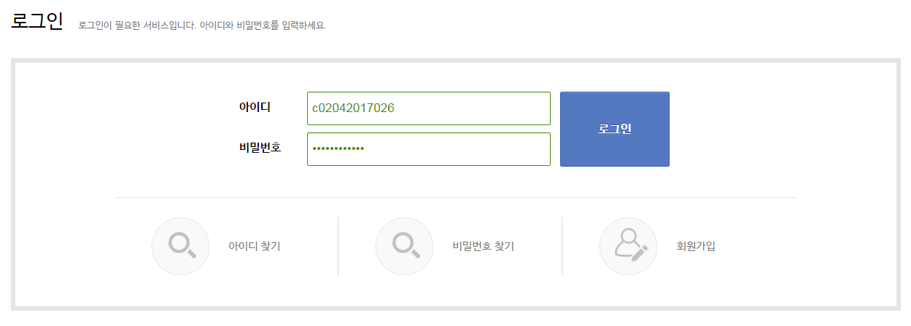

[Edison](http://www.edison.re.kr)은 [Open Science](http://www.ytn.co.kr/_ln/0115_201702010301329538)를 지향하는 계산과학 소프트웨어 연구개발 협업 플랫폼입니다. 여러분의 참여가 Edison 커뮤니티를 발전시키게 됩니다. 아래와 같이 참여해 주세요. 감사합니다.

## 설문조사 참여 하는 법

1. https://www.edison.re.kr/ 에 접속합니다. <Fig 1.>
2. 부여받은 아이디와 비밀번호(아이디와 동일)를 입력합니다. <Fig 2.>
3. 비밀번호를 변경합니다. <Fig 3.>
4. "설문조사 참여" 클릭합니다 <Fig 4.>
5. 설문조사에 참여합니다.

## 사이언스앱 실행방법

- TBD - 곧 공지예정입니다.

